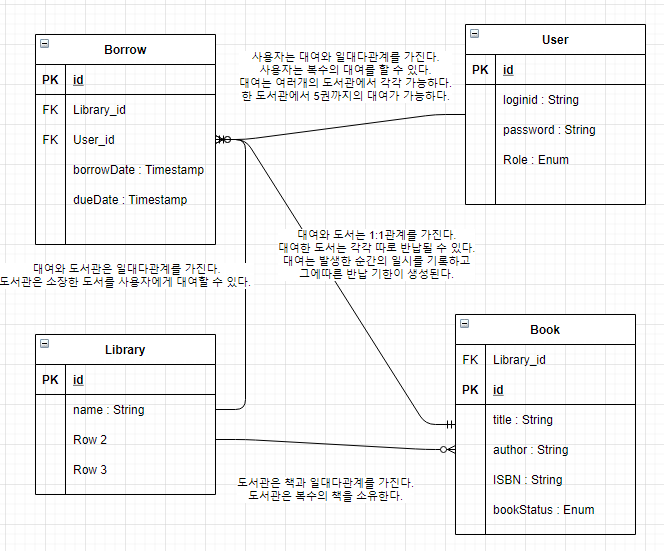

# 도서관 프로젝트

ATDD를 기반으로 간단한 Spring boot Application을 개발하는 프로젝트입니다.

---

## 요구사항

- 유저는 아이디 비밀번호로 회원가입을 진행할 수 있다
- 유저는 이용자와 관리자로 나눌 수 있다
- 관리자는 책을 등록 삭제 조회 수정이 가능하다
- 이용자는 도서관에서 책을 빌릴 수 있다
- 이용자는 자신의 빌린 책의 목록을 확인 할 수 있다
- 이용자는 최대 5권의 책을 빌릴 수 있다
- 도서관은 책을 중복해서 가질 수 있다
- 책은 제목과 작가와 도서 번호를 가진다

## 의존성

- spring-boot-starter-test
- spring-boot-starter-web
- h2database:h2
- spring-boot-starter-validation
- spring-boot-starter-webflux
- spring-boot-starter-data-jpa
- lombok

## DB 요구사항 정리



## 흐름

```java
@Entity
@Getter
@NoArgsConstructor(access = AccessLevel.PROTECTED)
public class Library {

    @Id
    @GeneratedValue
    @Column(name = "LIBRARY_ID")
    private Long id;

    private String name;
    private String address;

    @Builder
    Library(String name, String address) {
        this.name = name;
        this.address = address;
    }

    @OneToMany(mappedBy = "library", fetch = FetchType.LAZY)
    private List<Book> Books = new ArrayList<Book>();

    public LibraryDto.CreateResponse toResponseDto(){
        return LibraryDto.CreateResponse.builder()
                .id(id)
                .name(name)
                .address(address)
                .build();
    }
}
```

엔티티를 정의

```java
@AutoConfigureWebTestClient
@SpringBootTest(webEnvironment = SpringBootTest.WebEnvironment.RANDOM_PORT)
public class LibraryControllerTest {
    @Autowired
    private WebTestClient webTestClient;

    @Test
    void 도서관삽입테스트() {
        webTestClient.post().uri("/api/librarys")
                .contentType(MediaType.APPLICATION_JSON)
                .accept(MediaType.APPLICATION_JSON)
                .body(Mono.just(), )
                .exchange()
                .expectStatus().isCreated()
                .expectHeader().contentType(MediaType.APPLICATION_JSON)
                .expectBody()
                .returnResult()
                .getResponseBody();
    }
}
```

WebTestclient를 이용한 테스트를 생성

```java
@RestController
@RequiredArgsConstructor
@RequestMapping("/api")
public class LibraryController {
    @PostMapping("/librarys")
    public ResponseEntity<LibraryDto.CreateResponse> create(LibraryDto.CreateRequest dto){
        LibraryDto.CreateResponse resDto = new LibraryDto.CreateResponse(1L);
        return ResponseEntity
                .status(HttpStatus.CREATED)
                .body(resDto);
    }
}
```

최소한의 컨트롤러 생성

```java
public class LibraryDto {
    @Getter
    @NoArgsConstructor(access = AccessLevel.PROTECTED)
    public static class Request {
        private String name;
        private String address;

        @Builder
        Request(String name, String address) {
            this.name = name;
            this.address = address;
        }
        public Library toEntity() {
            return Library.builder()
                    .name(name)
                    .address(address)
                    .build();
        }
    }
    @Getter
    @NoArgsConstructor(access = AccessLevel.PROTECTED)
    public static class Response {
        private Long id;
        private String name;
        private String address;

        @Builder
        Response(Long id, String name, String address) {
            this.id = id;
            this.name = name;
            this.address = address;
        }
    }
}
```

dto의 요청과 응답을 통해 인풋과 아웃풋을 설정

```java
@ExtendWith(MockitoExtension.class)
public class LibraryServiceTest {
    @InjectMocks
    private LibraryService libraryService;
    @Mock
    private LibraryRepository libraryRepository;

    @Test
    void 라이브러리생성_정상(){
        LibraryDto.CreateRequest reqDto = new LibraryDto.CreateRequest("정독도서관");

        given(libraryRepository.save(any())).willReturn(new Library(reqDto.getName()));

        LibraryDto.CreateResponse resDto = libraryService.create(reqDto);

        assertThat(resDto).isNotNull();
    }
}
```

Mokcing을 통해 서비스 로직 검증

```java
@Service
@RequiredArgsConstructor
public class LibraryService {
    private final LibraryRepository libraryRepository;

    @Transactional
    public LibraryDto.CreateResponse create(LibraryDto.CreateRequest reqDto){
        Library library =  libraryRepository.save(reqDto.toEntity());
        return new LibraryDto.CreateResponse(library.getName());
    }
}
```

서비스구현

### DTO를 사용하는가,장점과 단점은?

[링크](https://entityframework.net/knowledge-base/21554977/should-services-always-return-dtos--or-can-they-also-return-domain-models-)

