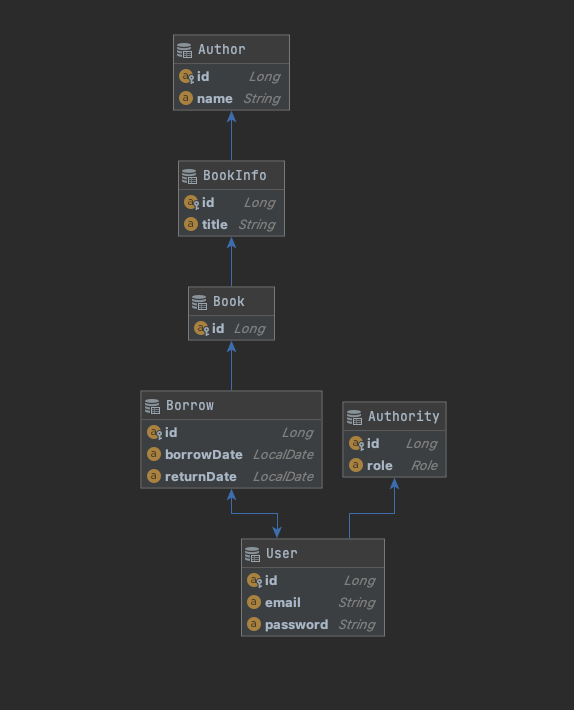

# 도서관 대출 시스템
이용자가 책을 빌릴 수 있도록 서비스를 제공한다

## 💡 요구사항
- 유저는 아이디 비밀번호로 회원가입을 진행할 수 있다 (o)
- 유저는 이용자와 관리자로 나눌 수 있다 (o)
- 관리자는 책을 등록 삭제 조회 수정이 가능하다 
- 이용자는 도서관에서 책을 빌릴 수 있다 (o)
- 이용자는 자신의 빌린 책의 목록을 확인 할 수 있다 (o)
- 이용자는 최대 5권의 책을 빌릴 수 있다
- 도서관은 책을 중복해서 가질 수 있다 (o)
- 책은 제목과 작가와 도서 번호를 가진다 (o)

## 🔨 기술 스택
- **Spring Framework**  
  Java를 이용해서 객체지향적인 애플리케이션을 만들기 위해서 사용
- **Spring MVC**  
  스프링을 기반으로 웹 서비스를 하기위해서 사용
- **Spring Data JPA**  
  개발 시간 단축과 DB말고 애플리케이션 코드에 더 집중하기 위해서 사용
- **H2**  
  H2는 자바로 만들어졌으며 그만큼 자바에대해 이식성이 높은 데이터베이스이다  
  Mysql이나 다른 DB가 지원하는 대부분의 기능을 지원할 뿐 아니라  
  Spring boot를 이용해서 작업할 시에 별다른 설정 파일을 만들어주지 않아도  
  연결이 가능하므로 빠르고 쉽게 테스트를 진행할 수 있다  
  위의 의견과 이번 프로젝트가 간단한 프로젝트인것을 감안했을 때  
  괜찮은 선택지라고 볼 수 있다
- **Rest API**
  
- **Mockito**  
service layer를 repository로 부터 분리해서 독립적인 테스트를 진행하기 위해서 사용

## ER 다이어그램

## 📡 API
### Author API
|HttpMethod|URL|Parameter|
|---|---|---|
|POST|/author|name : String|
|GET|/author|name : String|
|GET|/author/{author-id}||
|PUT|/author/|author-id : Long, name : String|

### BookInfo API
|HttpMethod|URL|Parameter|
|---|---|---|
|POST|/bookinfo|title : String|
|GET|/bookinfo/list||
|GET|/bookinfo|title : String|
|GET|/bookinfo|id : Long|
|PUT|/bookinfo|title : String|

### Book API
|HttpMethod|URL|Parameter|
|---|---|---|
|POST|/book||

### Borrow API
|HttpMethod|URL|Parameter|
|---|---|---|
|POST|/borrow/{user-id}|borrowDate : String, book-id : Long|
|GET|/borrow/{borrow-id}||
|GET|/borrow/{user-id}/list||
|PUT|/borrow/{borrow-id}|returnDate : String|

### User API
|HttpMethod|URL|Parameter|
|---|---|---|
|POST|/user|email : String, password : String|
|GET|/user/{user-id}||

## ❌ 문제 해결 또는 궁금점 해결
- **[Specification 오류/정리](./img/Specification.pdf)**
- **[Mockito any() 오류](./img/Mockito_.pdf)**
- **[Spring boot h2 db 초기설정](./img/Spring_boot_H2_.pdf)**
- **테스트가 안되는 상황**  
  - 정확한 원인은 모르겠으나 test 설정을 gradle -> Intellij로 변경후 IDE 재시작
- **유저가 빌릴 수 있는 책의개수를 설정을 어디서 해줄지**